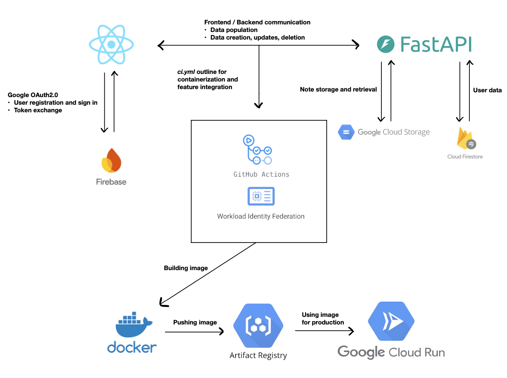

# CS1660 Final Project – Group 1 - [LIVE APP](https://notes-app-1037276530414.us-central1.run.app/)

This repository contains the final project for CS1660, developed by Group 1.

##### Our project is a cloud-based note-taking application that allows users to securely sign in, create and delete notes, and access them anytime. When users return, their notes will always be saved and ready.

The project features a full-stack web application with a **React.js** frontend and a **FastAPI** backend, containerized using **Docker**.

Google Cloud Platform (GCP) is employed to fulfill the functionalities of the website. The following GCP features are used:

- **Firestore**: Used as the primary NoSQL database to store user information

- **Cloud Storage**: Handles note file uploads

- **Google Authentication (OAuth 2.0)**: Enables secure user login with Google accounts via Firebase Auth integration.

- **Artifact Registry**: Stores and manages container images securely, integrated with CI/CD pipelines for seamless deployment.

- **Cloud Run**: Hosts both frontend and backend as containerized applications, auto-scaled based on traffic.

- **Workload Identity Federation / CI/CD Pipeline (GitHub Actions)**: Automates testing, container builds, and deployment to Cloud Run on every push to the main branch.

## 📁 Project Structure

```
cs1660-final-group1/
├── backend/               # FastAPI backend application
├── frontend/              # React frontend application
├── .github/workflows/     # GitHub Actions workflows
├── Dockerfile             # Dockerfile for containerizing the application
├── docker-compose.yml     # Docker Compose configuration
├── entrypoint.sh          # Entry point script for Docker container
├── adc.json               # ADC configuration file
├── .gitignore             # Git ignore file
└── README.md              # Project documentation
```

## 🚀 Getting Started

### Prerequisites

- [Docker](https://www.docker.com/) installed on your machine
- [Docker Compose](https://docs.docker.com/compose/) installed

### Installation and local run

1. **Clone the repository:**

   ```bash
   git clone https://github.com/maxm-akins/cs1660-final-group1.git
   cd cs1660-final-group1
   ```

2. **Build and run the application using Docker Compose:**

   ```bash
   docker-compose up --build
   ```

3. **Access the application:**

   - Frontend: [http://localhost:8000](http://localhost:8000)
   - Backend API: [http://localhost:8000/docs](http://localhost:8000/docs)

## 🧱 Setup

We settled on a React frontend and FastAPI backend due to combined group experience and the work we have already done in class. As you can see in the project structure above, we have our project split into two main folders each holding the required components for its side of the application. We utilize docker-compose and our DockerFile to containerize the application.

Our [ci.yml](.github/workflows/ci.yml) file holds all of the necessary code for implementing our CI/CD Pipeline (GitHub Actions). Those steps are as follows:

1. Authenticate to GCP
2. Docker login to Artifact Registry
3. Setup docker buildx
4. Build and Push
5. Deploy to Cloud Run

## 👨‍💻 Usage

Usage of the app is simple in nature. To use the note-taking features, one must sign in using Google's OAuth and once that is completed, they have full access. Note creation becomes as easy as filling out the form. Active notes appear below the entry form and can be deleted with the press of the red trash button at the bottom of each note.

See video demo included in the project submission for a full breakdown in less than three minutes!

## 💻 Architecture Details

Below is a diagram of how our project is infastructured. The diagram includes all components interations:

- Frontend and backend passing data
- Frontend connecting to Firebase to authenticate users
- Backend sending and requesting data and files from our DB and Cloud Store bucket.
- The building of our app's image, storing that image, and using it to build the live application



## 🤔 Comments and Considerations

_In this section, we include some details that we felt important to mention about our application._

##### 1. Notes storage

- In theory, this project is meant to serve as a large text file storage app where users may have pages and pages of content in a single note file. In this instance, it makes sense to use Cloud Storage to hold those large text files in a bucket. However, given the contraints of this being a college course and the project having an extemely limited user base, the notes themselves will likely be small and more for proof-of-concept. When the notes takes this kind of form, it would make more sense to use a database option like Firestore to hold them. It is faster and takes less computation to pull and store notes. With that being said, we built the app with the broader concept in mind, but felt that we should mention this nonetheless.

##### 2. User data

- In a fully flushed out version of this application, we would also include a profile page with some customizable options and information. However, for the sake of time and reduced complexity of the project, we figured it would be unnecessary for the delivery of the requirements.

##### 3. User data security

- For reasons similar to those mentioned in the second point above, our approach to securing user data is lack luster at best. In a true environment, one outside CS 1660, a much more secure methodology would be in place.

## 👥 Contributors

- [maxm-akins](https://github.com/maxm-akins)
- [samarohan](https://github.com/samarohan)
- [nLininger](https://github.com/nLininger)
- [ethannerone](https://github.com/ethannerone)
